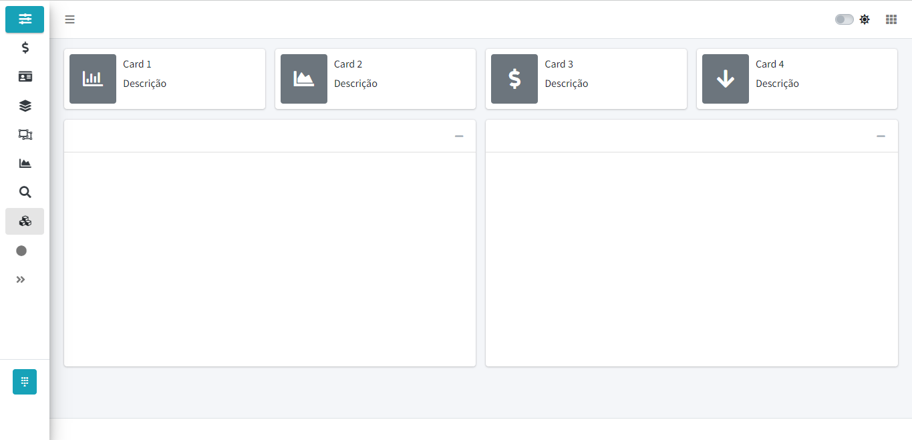

<h1 align="center">
    
</h1>

## Objetivos

Construir um modelo de dashboard que possa ser reutilizado em vários projetos, facilitando a implementação rápida. 

## Bibliotecas utilizadas 

[Shiny](https://shiny.rstudio.com/tutorial/) 
[bs4Dash](https://rinterface.github.io/bs4Dash/index.html)

## Autor

 

## Licença

Este projeto esta sobe a licença [GPL V2](./LICENSE).

Feito com ❤️ por Clayton Silva[Entre em contato!](https://www.linkedin.com/in/clayttonsilva/)
